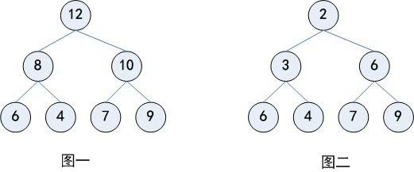

>什么是堆

>>堆（英语：Heap）是计算机科学中的一种特别的树状数据结构。若是满足以下特性，即可称为堆：“给定堆中任意节点P和C，若P是C的母节点，那么P的值会小于等于（或大于等于）C的值”。若母节点的值恒小于等于子节点的值，此堆称为最小堆（min heap）；反之，若母节点的值恒大于等于子节点的值，此堆称为最大堆（max heap）。在堆中最顶端的那一个节点，称作根节点（root node），根节点本身没有母节点（parent node）。
>>[堆](https://zh.wikipedia.org/wiki/%E5%A0%86%E7%A9%8D)

- 

- 最大堆
    - 父节点的值总是大于或等于子节点，整个堆最大的值是根节点

- 最小堆
    - 父节点的值总是小于或等于子节点，整个堆最小的值是根节点
    
- 最大最小堆的java实现:priorityqueue，底层用数组保存数据
    
- 斐波那契堆 

>优先队列 PriorityQueue，java里使用数组存储元素
>>底层使用二叉堆，应用有定时任务线程池
>>插入带优先级的元素（insert_with_priority）
  取出具有最高优先级的元素（pull_highest_priority_element）
  查看最高优先级的元素（peek）：O(1) 时间复杂度 