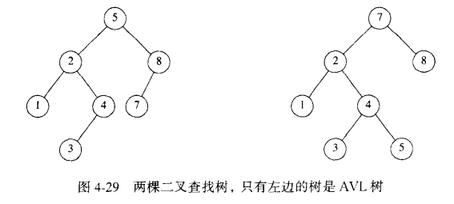
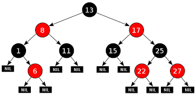

- 树，为什么要用树，树有什么好处，树的应用在哪里

- 二分查找
  - 是一种在有序数组中查找某一特定元素的搜索算法。搜索过程从数组的中间元素开始，如果中间元素正好是要查找的元素，则搜索过程结束；如果某一特定元素大于或者小于中间元素，则在数组大于或小于中间元素的那一半中查找，而且跟开始一样从中间元素开始比较。如果在某一步骤数组为空，则代表找不到。这种搜索算法每一次比较都使搜索范围缩小一半。

- 二叉搜索树
  - 基于二分查找
  - 若任意节点的左子树不空，则左子树上所有节点的值均小于它的根节点的值；
  - 若任意节点的右子树不空，则右子树上所有节点的值均大于它的根节点的值；
  - 任意节点的左、右子树也分别为二叉查找树；
  - 没有键值相等的节点。
  > 最左边的节点的值最小,最右边的节点值最大,优点是查找效率高,O(logn),但是可能在删除或插入后变成
  链表,导致查询效率为O(n)
  > 有左中右三种遍历方式,中序遍历可以按照顺序输出
  
  
- AVL树
  - 平衡二叉查找树,解决了二叉查找树在插入删除节点后变成链表导致的效率问题
  - 一棵AVL树是其每个结点的左子树和右子树的高度最多差1的二叉查找树。（空树的高度定义为-1）
  
  
- 红黑树
  - 不严格的AVL树,左子树和右子树的高度差不一定小于等于1
  - 它在二叉查找树的基础上增加了着色和相关的性质使得红黑树相对平衡，从而保证了红黑树的查找、插入、删除的时间复杂度最坏为O(log n)。
    
  - 特点
  1. 每个节点非红即黑
  2. 根节点是黑的;
  3. 每个叶节点（叶节点即树尾端NULL指针或NULL节点）都是黑的;
  4. 如图所示，如果一个节点是红的，那么它的两儿子都是黑的;
  5. 对于任意节点而言，其到叶子点树NULL指针的每条路径都包含相同数目的黑节点;
  6. 每条路径都包含相同的黑节点;
  - 红黑树能够以O(log2 n) 的时间复杂度进行搜索、插入、删除操作
  - java的实现为treemap
  
- B-树和B树是同一种树,Balance Tree平衡树,多路平衡查找树
  - 具体应用是操作系统文件索引结构,目的是减少磁盘IO的次数,避免一次性将整棵树载入到内存
  - 一个节点可以拥有2个以上的子节点
  
- B+树
  - mysql索引用这个实现,索引是什么?索引是帮助MySQL高效获取数据的数据结构。
  -   

- 哈弗曼树

- 2-3树

- 2-3-4树